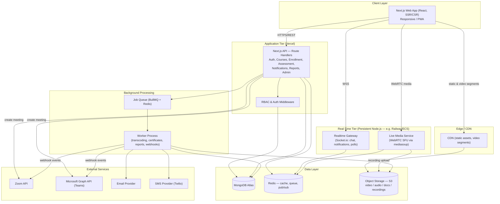
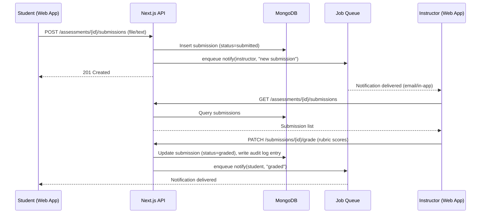
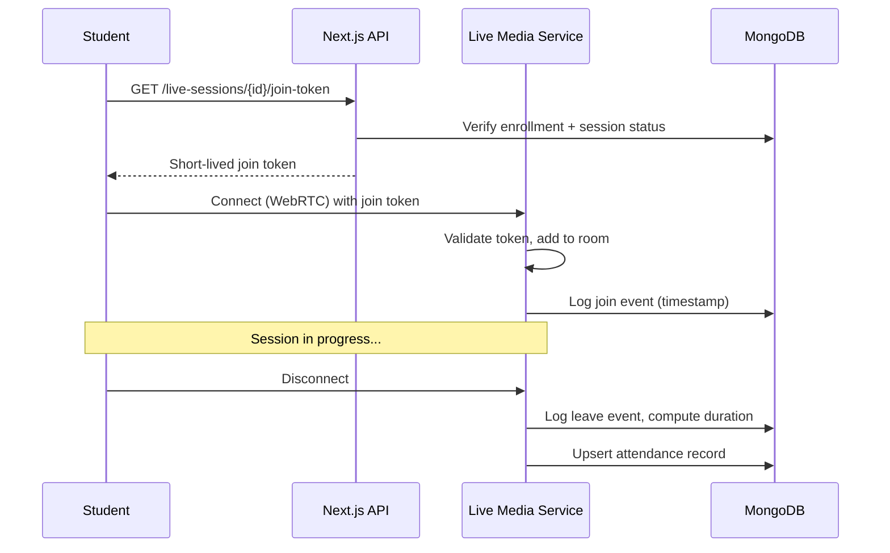
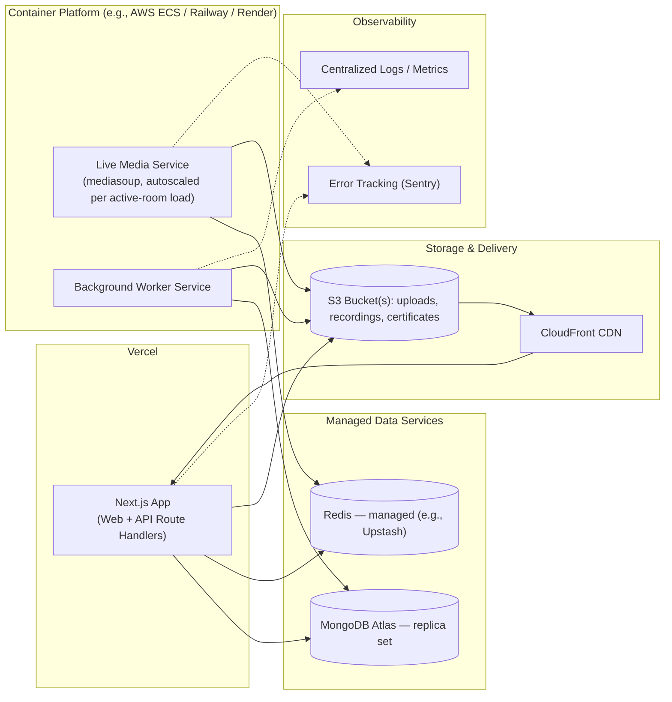

# System Architecture Document (SAD)
## LearnSphere — Learning Management System

| | |
|---|---|
| **Document Version** | 1.0 |
| **Related Documents** | PRD, SRS, Database Design Document, API Specification, UI/UX Design Specification |

---

## 1. Architecture Goals & Drivers

| Driver | Architectural Response |
|---|---|
| Startup MVP — ship fast, real users soon | Modular monolith on Next.js instead of microservices; managed cloud services (Atlas, S3, Vercel) over self-hosted infrastructure |
| Live classrooms need persistent, low-latency connections | A dedicated, always-on Node.js media service handles WebRTC (Next.js serverless functions are unsuitable for stateful media routing) |
| Flexible, evolving content model (courses, quizzes, gamification) | MongoDB's document model absorbs schema evolution without migrations blocking releases |
| Must scale from first cohort to many institutions | Stateless application tier, tenant-aware data model from day one (see DDD), horizontally scalable media workers |
| Security & auditability for student records | Centralized RBAC middleware, immutable audit log collection, encryption in transit and at rest |

---

## 2. Architecture Style

LearnSphere follows a **modular monolith with a companion real-time service**:

- **Primary application** — a single Next.js application (App Router) serves both the React frontend and the REST API (via Route Handlers), organized internally into clear domain modules (auth, courses, enrollment, assessment, notifications, etc.). This is the fast path for an MVP: one deployable unit, shared types between client and server, minimal operational overhead.
- **Live Media Service** — a standalone Node.js service (not part of the Next.js deploy) responsible for WebRTC SFU (Selective Forwarding Unit) media routing, in-session signaling, whiteboard/poll state, and recording orchestration. This is architecturally separated because WebRTC media routing requires long-lived stateful processes and direct UDP/TCP media transport that serverless platforms do not support well.
- **Background Worker** — a Node.js worker process (can run alongside the media service or independently) consumes a job queue (BullMQ on Redis) for asynchronous tasks: video transcoding kickoff, certificate PDF generation, bulk notification dispatch, report generation, and Zoom/MS Teams webhook processing.

This gives the MVP the simplicity of a monolith for 90% of functionality while isolating the one component (live media) that genuinely needs a different runtime model.

---

## 3. High-Level Component Diagram

---

## 4. Component Responsibilities

### 4.1 Next.js Web Application (Client)
- Renders role-specific UIs: public catalog, student dashboard, instructor authoring workspace, admin console, live classroom UI, alumni portal.
- Uses **Server Components** for data-heavy, SEO-relevant, or read-mostly views (course catalog, public pages) and **Client Components** for interactive surfaces (course builder drag-and-drop, live classroom, dashboards with client-side state).
- State/data-fetching: React Query (TanStack Query) for client-side cache of API data; Zustand for local UI state (e.g., active whiteboard tool).
- Styling: Tailwind CSS + a component library (shadcn/ui) for consistent, accessible components (see UI/UX Spec).

### 4.2 Next.js API Layer (Route Handlers)
Organized by domain module, each exposing REST endpoints under `/api/v1/*` (full contract in the OpenAPI Specification):
- `auth` — registration, login, token refresh, password reset
- `users` — profile, role management
- `courses` — authoring, publishing, templates, catalog
- `enrollments` — self-enroll, approval workflow, bulk actions
- `content` — signed upload URLs, progress tracking
- `assessments` — assignments, quizzes, submissions, grading
- `live-sessions` — scheduling, join orchestration (native + Zoom/Teams), attendance
- `forums` / `messages` — collaboration
- `notifications` — preferences, delivery log
- `gamification` — badges, points, leaderboards
- `certificates` — generation, verification
- `events` — webinar/event management
- `admin` — user management, approvals, audit log, tenant config
- `reports` — dashboard aggregates, exports

Cross-cutting middleware: authentication (JWT verification), RBAC authorization, request validation (schema-based, e.g., Zod), rate limiting, and audit logging hooks on sensitive mutations.

### 4.3 Live Media Service
- Implements a WebRTC SFU (e.g., **mediasoup**) so each participant uploads media once and the server fans it out, keeping client bandwidth manageable at 100+ participants.
- Manages room lifecycle (create on session start, tear down on session end), participant join/leave events (feeding attendance calculation), in-room chat relay, poll/quiz state broadcast, and whiteboard event relay.
- Pipes session audio/video to a recording pipeline that writes segments to S3; the worker later stitches/transcodes the final recording asset.
- Communicates room/session state to the main application via authenticated internal API calls and Redis pub/sub (so the Next.js API and dashboards can reflect "session live" status in real time).

### 4.4 Realtime Gateway (Socket.io)
- Handles lighter-weight real-time features that don't require media: in-app notification delivery, forum/message live updates, "user is typing," and live-session status badges shown outside the classroom itself.
- Backed by Redis adapter so it can run multiple instances behind a load balancer.

### 4.5 Background Worker & Job Queue
- **Video transcoding**: on upload, triggers transcoding to adaptive bitrate renditions (e.g., via AWS Elemental MediaConvert or an ffmpeg-based job) and writes an HLS/DASH manifest referenced by the content record.
- **Certificate generation**: renders a PDF certificate with a unique verification code upon course-completion trigger.
- **Notification dispatch**: batches and sends email/SMS through provider APIs, respecting user preferences and rate limits.
- **Report generation**: precomputes heavier dashboard aggregates (e.g., institution-wide monthly reports) on a schedule rather than on-demand.
- **Provider webhook processing**: consumes Zoom/MS Teams webhooks (recording ready, meeting ended) asynchronously and updates the corresponding session record.

### 4.6 Data Layer
- **MongoDB Atlas**: system of record — see Database Design Document for full schema, indexing, and relationship strategy.
- **Redis**: (a) BullMQ job queue backing store, (b) Socket.io pub/sub adapter for multi-instance real-time messaging, (c) short-TTL cache for expensive read aggregates (e.g., leaderboard, dashboard summaries).
- **Object Storage (S3-compatible)**: all binary assets — raw uploads, transcoded video renditions, recordings, generated certificate PDFs, forum attachments.
- **CDN**: fronts S3 and static Next.js assets for low-latency global delivery.

### 4.7 External Integrations
- **Zoom API / Microsoft Graph API (Teams)**: used only when an Instructor selects that delivery mode for a live session — creates the meeting, retrieves the join URL, and (via webhook) retrieves recording/attendance data after the session.
- **Email/SMS providers**: transactional and reminder notifications.

---

## 5. Data Flow — Illustrative Sequences

### 5.1 Assignment Submission & Grading

### 5.2 Native Live Session Join & Attendance

---

## 6. Deployment Architecture

**Environment strategy:** `development` → `staging` → `production`, each with isolated MongoDB Atlas project/cluster tier, isolated S3 bucket prefix, and isolated third-party API keys (Zoom/MS Teams sandbox credentials in non-prod).

**Why this split:**
- Next.js app deploys to Vercel for zero-ops scaling of the request/response workload and to get SSR/edge caching benefits for the marketing/catalog pages.
- The media service and worker run on a container platform because they need long-lived processes, direct socket/UDP access (media service), and predictable background CPU (transcoding, PDF rendering) that don't fit a serverless request/response model.

---

## 7. Scalability & Performance Strategy

| Concern | Strategy |
|---|---|
| Application tier scaling | Stateless Next.js instances scale horizontally behind Vercel's platform; no server-side session state (JWT-based auth). |
| Database read load | Read-heavy aggregates (dashboards, leaderboards) are cached in Redis with short TTLs (30–120s) and/or precomputed by the worker on a schedule; MongoDB indexes tuned per the DDD. |
| Video delivery | Adaptive bitrate renditions + CDN edge caching keep load off the origin and application tier entirely for playback. |
| Live classroom scale | Media service instances are provisioned per active room load; a room is pinned to one SFU instance, and new rooms are scheduled to the least-loaded instance (simple bin-packing at MVP scale; can evolve to a dedicated media-server orchestrator later). |
| Database growth | MongoDB collections are designed with tenant/institution scoping and indexed accordingly (see DDD) so query cost doesn't grow with total platform size, only with a given institution's data. |
| Notification bursts | Notification dispatch goes through the job queue rather than inline in the request path, so a broadcast to a large cohort doesn't block API responsiveness. |

---

## 8. Security Architecture

- **AuthN**: Credentials + optional OAuth (Google) via NextAuth.js; JWT access tokens (short-lived, ~15 min) plus refresh tokens (longer-lived, rotated, stored as httpOnly secure cookies).
- **AuthZ**: Centralized RBAC middleware evaluated on every API route; permissions are role + resource-ownership based (e.g., an Instructor can only grade submissions for courses they own).
- **Transport security**: TLS everywhere (enforced by Vercel/CDN edge and the container platform's load balancer).
- **Data protection**: MongoDB Atlas encryption at rest; S3 server-side encryption; secrets (API keys, DB credentials) managed via the platform's secret manager, never committed to source.
- **Input validation**: All API inputs validated against schemas (Zod) at the route boundary before touching business logic.
- **Audit logging**: Sensitive mutations (grades, enrollment, publishing, role changes) write to an append-only `audit_logs` collection (see DDD) via a shared service-layer hook, not left to individual route handlers to remember.
- **Abuse prevention**: Rate limiting (per-IP and per-user) on auth endpoints and write-heavy endpoints; account lockout after repeated failed logins (FR-AUTH-08).
- **File safety**: Upload type/size validation at the API boundary before issuing a pre-signed S3 upload URL; optional malware scanning hook in the worker pipeline before a file is marked "available."

---

## 9. Technology Stack Summary

| Layer | Technology |
|---|---|
| Frontend framework | Next.js 14+ (App Router), React, TypeScript |
| Styling / UI components | Tailwind CSS, shadcn/ui |
| Client state/data | TanStack Query, Zustand |
| Backend/API | Next.js Route Handlers (Node.js runtime), TypeScript |
| Auth | NextAuth.js, JWT (access + refresh) |
| Database | MongoDB Atlas, Mongoose ODM |
| Cache / Queue / Pub-Sub | Redis, BullMQ |
| Real-time (non-media) | Socket.io |
| Live classroom media | Node.js + mediasoup (WebRTC SFU) |
| Object storage | AWS S3 (or compatible) |
| CDN | AWS CloudFront (or equivalent) |
| Video transcoding | AWS Elemental MediaConvert or ffmpeg worker |
| Email | Resend or SendGrid |
| SMS | Twilio |
| Third-party live classroom | Zoom API, Microsoft Graph API (Teams) |
| Validation | Zod |
| Testing | Jest / Vitest, Playwright (E2E) |
| Error tracking / monitoring | Sentry, Vercel Analytics |
| CI/CD | GitHub Actions → Vercel (app), container registry → ECS/Railway (media/worker) |
| Hosting | Vercel (app tier), AWS ECS or Railway (media/worker tier), MongoDB Atlas, Upstash Redis |

---

## 10. Architectural Decisions Log (Summary)

| Decision | Rationale | Alternative Considered |
|---|---|---|
| Modular monolith (Next.js full-stack) over microservices | MVP speed, single deploy, shared TypeScript types client/server | Full microservices — rejected as premature for MVP team size/timeline |
| MongoDB over relational DB | Course/content structures are naturally nested and evolve quickly (modules, lessons, mixed content types, rubrics); document model avoids constant migrations during rapid MVP iteration | PostgreSQL — viable, but would need heavier JSONB usage to match flexibility; MongoDB chosen per stakeholder decision |
| Separate service for live media | WebRTC SFU needs persistent processes and direct media transport incompatible with serverless functions | Fully third-party (Zoom/Teams only) — rejected because product differentiation requires a native option; addressed instead via hybrid approach |
| Hybrid live-classroom strategy (native + Zoom/Teams) | De-risks launch (proven third-party path) while preserving the differentiated native experience as it matures | Native-only — riskier for MVP timeline; Third-party-only — loses differentiation |
| Job queue for async work | Keeps API response times low; isolates flaky third-party calls (email/SMS/webhooks) from user-facing request paths | Inline processing — rejected due to latency and reliability risk |

---
*End of System Architecture Document.*
