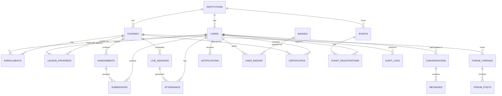

# Database Design Document (DDD)
## LearnSphere — Learning Management System (MongoDB)

| | |
|---|---|
| **Document Version** | 1.0 |
| **Database** | MongoDB Atlas, accessed via Mongoose ODM |
| **Related Documents** | PRD, SRS, System Architecture Document, API Specification |

---

## 1. Overview & Design Rationale

LearnSphere uses **MongoDB** as its primary datastore. The document model fits the domain well:

- Course structure (modules → lessons → content items) is a naturally nested, variable-depth tree that would require several join tables in a relational schema; in MongoDB it is modeled as a single, coherent course document.
- Assessment structures (quiz questions, rubric criteria) vary in shape per assessment; a flexible schema avoids constant migrations during MVP iteration.
- High-write, high-cardinality data (per-student progress, attendance, notifications) is kept in **separate collections referencing IDs**, so it doesn't bloat or lock frequently-read structural documents (courses).

**General modeling rule applied throughout this document:**
> Embed data that is (a) bounded in size, (b) always read together with its parent, and (c) not independently high-write. Reference data that is (a) unbounded/high-cardinality, (b) written independently and frequently, or (c) needed across multiple parents.

### 1.1 Multi-Tenancy / Scoping
Every core collection carries an `institutionId` field (ObjectId reference to `institutions`) to scope data per customer institution, in anticipation of multi-tenant SaaS growth (PRD §3.1, SAD §10). All list/query operations are expected to filter by `institutionId` at the application layer, and it is included in relevant compound indexes.

### 1.2 Schema Enforcement
Although MongoDB is schema-flexible, LearnSphere enforces structure at two layers:
1. **Mongoose schemas** (application layer) — type coercion, required fields, defaults, custom validators.
2. **MongoDB JSON Schema validation** (`$jsonSchema` on collection creation) — a database-level backstop that rejects malformed documents even from direct DB access, covering required fields and enum constraints on critical collections (`users`, `enrollments`, `submissions`, `audit_logs`).

---

## 2. Collection Inventory

| Collection | Purpose | Write Pattern |
|---|---|---|
| `institutions` | Tenant record: institution profile, plan, feature flags, integration credentials | Low-write |
| `users` | All user accounts across roles (Student, Instructor, Admin, Super Admin, Alumnus) | Medium-write |
| `courses` | Course metadata + embedded module/lesson structure | Low-write (authoring-time), high-read |
| `enrollments` | Student ↔ course relationship, status, completion state | Medium-write |
| `lesson_progress` | Per-student, per-lesson consumption/completion tracking | High-write |
| `assessments` | Assignments and quizzes (embedded questions/rubric) | Low-write, high-read |
| `submissions` | Student submissions + grading result | High-write |
| `live_sessions` | Scheduled/completed live classroom sessions (native or Zoom/Teams) | Medium-write |
| `attendance` | Per-user, per-session attendance record | High-write |
| `forum_threads` | Discussion forum threads per course | Medium-write |
| `forum_posts` | Replies within a thread | High-write |
| `conversations` | Direct-message / group channel metadata | Low-write |
| `messages` | Individual chat messages within a conversation | High-write |
| `notifications` | Per-user notification delivery record (in-app feed) | High-write |
| `badges` | Badge/achievement definitions (catalog) | Low-write |
| `user_badges` | Badges awarded to a user | Medium-write |
| `certificates` | Issued completion certificates | Low-write |
| `events` | Standalone webinars/events | Low-write |
| `event_registrations` | Registrations for events | Medium-write |
| `audit_logs` | Immutable record of sensitive actions | Medium-write, append-only |

---

## 3. Collection Schemas

### 3.1 `institutions`

```
{
  _id: ObjectId,
  name: String,                    // required
  slug: String,                    // required, unique, url-safe
  plan: String,                    // enum: "trial" | "starter" | "growth" | "enterprise"
  branding: {
    logoUrl: String,
    primaryColor: String
  },
  featureFlags: {
    nativeLiveClassroom: Boolean,      // default true
    zoomIntegration: Boolean,          // default false
    teamsIntegration: Boolean,         // default false
    alumniPortal: Boolean,             // default true
    gamification: Boolean              // default true
  },
  integrationCredentials: {
    zoom: { apiKeyRef: String, apiSecretRef: String },     // references to secret manager, not raw secrets
    msTeams: { clientIdRef: String, clientSecretRef: String }
  },
  createdAt: Date,
  updatedAt: Date
}
```
**Indexes:** `{ slug: 1 }` unique.

---

### 3.2 `users`

```
{
  _id: ObjectId,
  institutionId: ObjectId,          // ref institutions, required
  email: String,                    // required, unique per institution
  passwordHash: String,             // null if OAuth-only
  authProviders: [String],          // e.g. ["credentials", "google"]
  fullName: String,                 // required
  avatarUrl: String,
  role: String,                     // enum: "super_admin" | "admin" | "instructor" | "student" | "alumnus", required
  status: String,                   // enum: "pending_verification" | "active" | "suspended" | "deactivated"
  emailVerifiedAt: Date,
  failedLoginAttempts: Number,      // default 0
  lockedUntil: Date,
  locale: String,                   // default "en"
  notificationPreferences: {
    email: Boolean,                 // default true
    sms: Boolean,                   // default false
    inApp: Boolean                  // default true
  },
  gamification: {
    totalPoints: Number,            // default 0
    leaderboardOptOut: Boolean      // default false
  },
  alumniProfile: {                  // present only if role transitions to alumnus
    graduationCohort: String,
    industry: String,
    directoryOptIn: Boolean
  },
  lastLoginAt: Date,
  createdAt: Date,
  updatedAt: Date
}
```
**Indexes:**
- `{ institutionId: 1, email: 1 }` unique
- `{ institutionId: 1, role: 1 }`
- `{ "alumniProfile.directoryOptIn": 1 }` (partial index, sparse)

**Example document:**
```json
{
  "_id": "665f1a2b3c4d5e6f7a8b9c0d",
  "institutionId": "665f1a2b3c4d5e6f7a8b9c00",
  "email": "sara.student@example.com",
  "fullName": "Sara Ahmed",
  "role": "student",
  "status": "active",
  "notificationPreferences": { "email": true, "sms": false, "inApp": true },
  "gamification": { "totalPoints": 420, "leaderboardOptOut": false },
  "createdAt": "2026-01-10T09:00:00Z"
}
```

---

### 3.3 `courses`

Modules and lessons are **embedded** — they are structural, bounded in count (a course realistically has dozens, not millions, of lessons), and always read together with the course when a student views the syllabus.

```
{
  _id: ObjectId,
  institutionId: ObjectId,
  instructorId: ObjectId,           // ref users
  title: String,
  slug: String,
  description: String,
  category: String,
  coverImageUrl: String,
  language: String,                 // default "en"
  status: String,                   // enum: "draft" | "pending_review" | "published" | "rejected" | "archived"
  reviewedBy: ObjectId,              // ref users (Admin), nullable
  reviewComment: String,             // populated on rejection
  enrollmentMode: String,            // enum: "open" | "approval_required"
  enrollmentCapacity: Number,        // nullable = unlimited
  isTemplate: Boolean,               // default false
  clonedFromCourseId: ObjectId,      // nullable, ref courses — set when created from a template
  completionCriteria: {
    minGradePercent: Number,         // e.g. 60
    minAttendancePercent: Number     // e.g. 75
  },
  modules: [
    {
      _id: ObjectId,
      title: String,
      order: Number,
      releaseRule: {
        type: String,                // enum: "immediate" | "fixed_date" | "offset_from_enrollment"
        date: Date,                  // used when type = fixed_date
        offsetDays: Number           // used when type = offset_from_enrollment
      },
      lessons: [
        {
          _id: ObjectId,
          title: String,
          order: Number,
          contentItems: [
            {
              _id: ObjectId,
              type: String,          // enum: "video" | "audio" | "document" | "article" | "downloadable" | "embedded_quiz"
              title: String,
              storageKey: String,    // S3 object key (for media/document types)
              streamingManifestUrl: String, // HLS/DASH manifest, video only
              textBody: String,      // for "article" type
              linkedAssessmentId: ObjectId, // for "embedded_quiz" type, ref assessments
              durationSeconds: Number,      // video/audio only
              order: Number
            }
          ]
        }
      ]
    }
  ],
  version: Number,                   // incremented on each publish; see §5 versioning note
  createdAt: Date,
  updatedAt: Date,
  publishedAt: Date,
  archivedAt: Date
}
```
**Indexes:**
- `{ institutionId: 1, status: 1 }`
- `{ institutionId: 1, slug: 1 }` unique
- `{ instructorId: 1 }`
- Text index on `{ title: "text", description: "text" }` for catalog search (or MongoDB Atlas Search in production — see SAD §4.6)

---

### 3.4 `enrollments`

```
{
  _id: ObjectId,
  institutionId: ObjectId,
  courseId: ObjectId,               // ref courses
  studentId: ObjectId,              // ref users
  status: String,                   // enum: "pending_approval" | "active" | "completed" | "dropped" | "rejected"
  enrolledAt: Date,
  approvedBy: ObjectId,             // ref users, nullable
  completedAt: Date,
  finalGradePercent: Number,        // nullable until computed
  droppedReason: String,            // nullable
  droppedBy: ObjectId               // ref users, nullable
}
```
**Indexes:**
- `{ studentId: 1, courseId: 1 }` unique
- `{ courseId: 1, status: 1 }`
- `{ institutionId: 1, status: 1 }`

---

### 3.5 `lesson_progress`

High-write, one document per student per lesson.

```
{
  _id: ObjectId,
  institutionId: ObjectId,
  studentId: ObjectId,
  courseId: ObjectId,
  moduleId: ObjectId,
  lessonId: ObjectId,
  status: String,                   // enum: "not_started" | "in_progress" | "completed"
  percentConsumed: Number,          // 0-100, primarily for video/audio
  lastAccessedAt: Date,
  completedAt: Date
}
```
**Indexes:**
- `{ studentId: 1, lessonId: 1 }` unique
- `{ studentId: 1, courseId: 1 }`

---

### 3.6 `assessments`

Covers both assignments and quizzes/tests via a `type` discriminator.

```
{
  _id: ObjectId,
  institutionId: ObjectId,
  courseId: ObjectId,
  moduleId: ObjectId,               // nullable if course-level, not module-scoped
  createdBy: ObjectId,              // ref users (instructor)
  type: String,                     // enum: "assignment" | "quiz"
  title: String,
  instructions: String,
  dueAt: Date,
  allowLateSubmission: Boolean,
  latePenaltyPercentPerDay: Number, // nullable
  maxScore: Number,
  weightPercent: Number,            // contribution to final course grade
  submissionTypes: [String],        // enum values: "file" | "text", for type=assignment
  rubric: [                          // used for rubric-based grading
    {
      criterion: String,
      maxPoints: Number,
      description: String
    }
  ],
  questions: [                       // used when type = "quiz"
    {
      _id: ObjectId,
      questionType: String,          // enum: "multiple_choice" | "true_false" | "matching" | "essay"
      prompt: String,
      options: [String],             // for multiple_choice / matching
      correctAnswer: String,         // or array for matching; null for essay (manual grading)
      points: Number
    }
  ],
  status: String,                    // enum: "draft" | "published" | "closed"
  createdAt: Date,
  updatedAt: Date
}
```
**Indexes:**
- `{ courseId: 1, status: 1 }`
- `{ courseId: 1, dueAt: 1 }`

---

### 3.7 `submissions`

```
{
  _id: ObjectId,
  institutionId: ObjectId,
  assessmentId: ObjectId,           // ref assessments
  studentId: ObjectId,
  courseId: ObjectId,               // denormalized for query efficiency
  submittedAt: Date,
  isLate: Boolean,
  answers: [                         // for quiz type
    {
      questionId: ObjectId,
      response: String,             // or array for matching/multi-select
      autoGradedCorrect: Boolean,   // nullable, objective types only
      pointsAwarded: Number
    }
  ],
  fileUploads: [                     // for assignment type
    { storageKey: String, fileName: String, mimeType: String, sizeBytes: Number }
  ],
  textResponse: String,
  status: String,                    // enum: "submitted" | "auto_graded" | "grading" | "graded"
  rubricScores: [                    // when rubric-graded
    { criterion: String, pointsAwarded: Number, comment: String }
  ],
  totalScore: Number,
  totalScorePercent: Number,
  instructorComment: String,
  gradedBy: ObjectId,                // ref users, nullable
  gradedAt: Date
}
```
**Indexes:**
- `{ assessmentId: 1, studentId: 1 }` unique
- `{ courseId: 1, status: 1 }`
- `{ studentId: 1, courseId: 1 }`

---

### 3.8 `live_sessions`

```
{
  _id: ObjectId,
  institutionId: ObjectId,
  courseId: ObjectId,
  instructorId: ObjectId,
  title: String,
  scheduledStart: Date,
  scheduledEnd: Date,
  actualStart: Date,
  actualEnd: Date,
  deliveryMode: String,             // enum: "native" | "zoom" | "ms_teams"
  status: String,                   // enum: "scheduled" | "live" | "ended" | "cancelled"
  nativeRoomId: String,             // internal media-service room identifier, native mode only
  externalMeeting: {                 // populated for zoom/ms_teams
    provider: String,               // "zoom" | "ms_teams"
    meetingId: String,
    joinUrl: String,
    hostUrl: String
  },
  recording: {
    storageKey: String,             // native mode: S3 key after worker processing
    externalRecordingUrl: String,   // zoom/teams mode: provider-hosted URL, if retrievable
    status: String,                 // enum: "not_available" | "processing" | "available"
    durationSeconds: Number
  },
  pollsAndQuizzes: [                 // in-session interactive activity log (native mode)
    {
      _id: ObjectId,
      question: String,
      options: [String],
      results: [ { option: String, count: Number } ],
      launchedAt: Date
    }
  ],
  createdAt: Date,
  updatedAt: Date
}
```
**Indexes:**
- `{ courseId: 1, scheduledStart: 1 }`
- `{ institutionId: 1, status: 1 }`

---

### 3.9 `attendance`

```
{
  _id: ObjectId,
  institutionId: ObjectId,
  liveSessionId: ObjectId,
  studentId: ObjectId,
  courseId: ObjectId,               // denormalized
  joinedAt: Date,
  leftAt: Date,
  durationSeconds: Number,
  attendancePercent: Number,        // durationSeconds / session length
  source: String,                   // enum: "native_auto" | "provider_report" | "manual_override"
  manualOverrideBy: ObjectId,       // ref users, nullable
  manualOverrideReason: String
}
```
**Indexes:**
- `{ liveSessionId: 1, studentId: 1 }` unique
- `{ studentId: 1, courseId: 1 }`

---

### 3.10 `forum_threads` and `forum_posts`

```
// forum_threads
{
  _id: ObjectId,
  institutionId: ObjectId,
  courseId: ObjectId,
  createdBy: ObjectId,              // ref users
  title: String,
  isQuestion: Boolean,              // enables Q&A "accepted answer" behavior
  acceptedPostId: ObjectId,         // nullable, ref forum_posts
  postCount: Number,                // denormalized counter
  lastActivityAt: Date,
  createdAt: Date
}

// forum_posts
{
  _id: ObjectId,
  threadId: ObjectId,               // ref forum_threads
  courseId: ObjectId,               // denormalized
  authorId: ObjectId,
  body: String,
  parentPostId: ObjectId,           // nullable, for nested replies
  createdAt: Date,
  editedAt: Date
}
```
**Indexes:**
- `forum_threads`: `{ courseId: 1, lastActivityAt: -1 }`
- `forum_posts`: `{ threadId: 1, createdAt: 1 }`

---

### 3.11 `conversations` and `messages`

```
// conversations
{
  _id: ObjectId,
  institutionId: ObjectId,
  type: String,                     // enum: "direct" | "group"
  courseId: ObjectId,               // nullable, scoping context for group channels
  participantIds: [ObjectId],       // ref users
  lastMessageAt: Date,
  createdAt: Date
}

// messages
{
  _id: ObjectId,
  conversationId: ObjectId,
  senderId: ObjectId,
  body: String,
  readBy: [ObjectId],               // user IDs who have read this message
  createdAt: Date
}
```
**Indexes:**
- `conversations`: `{ participantIds: 1 }`
- `messages`: `{ conversationId: 1, createdAt: 1 }`

---

### 3.12 `notifications`

```
{
  _id: ObjectId,
  institutionId: ObjectId,
  userId: ObjectId,
  type: String,                     // enum: "deadline_reminder" | "grade_posted" | "enrollment_status" |
                                     //       "session_reminder" | "announcement" | "forum_reply" | "message" | "badge_awarded"
  title: String,
  body: String,
  channels: [String],               // subset of ["in_app","email","sms"] actually attempted
  relatedEntity: { type: String, id: ObjectId },  // polymorphic reference, e.g. {type:"submission", id:...}
  isRead: Boolean,                  // default false, in-app read state
  createdAt: Date
}
```
**Indexes:**
- `{ userId: 1, isRead: 1, createdAt: -1 }`

---

### 3.13 `badges` and `user_badges`

```
// badges (catalog, low-write)
{
  _id: ObjectId,
  institutionId: ObjectId,
  code: String,                     // unique slug, e.g. "on_time_streak_5"
  name: String,
  description: String,
  iconUrl: String,
  pointsValue: Number
}

// user_badges
{
  _id: ObjectId,
  userId: ObjectId,
  badgeId: ObjectId,
  courseId: ObjectId,               // nullable, if course-specific
  awardedAt: Date
}
```
**Indexes:**
- `user_badges`: `{ userId: 1, badgeId: 1, courseId: 1 }` unique

---

### 3.14 `certificates`

```
{
  _id: ObjectId,
  institutionId: ObjectId,
  studentId: ObjectId,
  courseId: ObjectId,
  verificationCode: String,         // unique, public-lookup safe
  storageKey: String,               // generated PDF in S3
  issuedAt: Date,
  finalGradePercent: Number
}
```
**Indexes:**
- `{ verificationCode: 1 }` unique
- `{ studentId: 1, courseId: 1 }` unique

---

### 3.15 `events` and `event_registrations`

```
// events
{
  _id: ObjectId,
  institutionId: ObjectId,
  createdBy: ObjectId,
  title: String,
  description: String,
  startAt: Date,
  endAt: Date,
  capacity: Number,                 // nullable = unlimited
  audience: [String],               // e.g. ["student","alumnus"]
  joinUrl: String,
  createdAt: Date
}

// event_registrations
{
  _id: ObjectId,
  eventId: ObjectId,
  userId: ObjectId,
  registeredAt: Date,
  attended: Boolean
}
```
**Indexes:**
- `event_registrations`: `{ eventId: 1, userId: 1 }` unique

---

### 3.16 `audit_logs`

Append-only; no update/delete permitted at the application layer.

```
{
  _id: ObjectId,
  institutionId: ObjectId,
  actorId: ObjectId,                // ref users
  actorRole: String,
  action: String,                   // e.g. "grade.update" | "enrollment.status_change" |
                                     //      "course.publish" | "user.role_change" | "user.deactivate"
  targetEntity: { type: String, id: ObjectId },
  before: Object,                   // nullable snapshot
  after: Object,                    // nullable snapshot
  ipAddress: String,
  createdAt: Date
}
```
**Indexes:**
- `{ institutionId: 1, createdAt: -1 }`
- `{ actorId: 1, createdAt: -1 }`
- `{ "targetEntity.type": 1, "targetEntity.id": 1 }`

---

## 4. Entity Relationship Overview



---

## 5. Course Versioning Note

`courses.version` increments each time a published course is re-published after edits. `submissions` and `enrollments` reference the course by ID only, but grade-relevant fields (e.g., `maxScore`, `weightPercent`) on `assessments` are **not mutated in place** after an assessment has any submissions — instead, an edit to a live assessment creates a new assessment revision and closes the prior one (`status: "closed"`), preserving grading integrity per FR-COURSE-09. This avoids needing full document-level versioning of the entire `courses` tree at MVP stage while still protecting historical grade accuracy.

---

## 6. Indexing Strategy Summary

| Principle | Applied Example |
|---|---|
| Every collection scoped by tenant is indexed with `institutionId` as a leading compound-index field where the query pattern justifies it | `courses: { institutionId, status }` |
| Uniqueness constraints enforced at the database level, not just application level | `enrollments: { studentId, courseId }` unique |
| High-read, low-write catalogs get a text (or Atlas Search) index | `courses.title/description` |
| High-write collections avoid unnecessary secondary indexes to keep write latency low | `lesson_progress`, `attendance` carry only the indexes needed for their known query patterns |
| Time-ordered feeds use a descending index on the timestamp used for sorting | `notifications: { userId, isRead, createdAt: -1 }` |

---

## 7. Data Retention & Archival

- **Live session recordings**: retained per institution's configured retention policy (default 12 months), after which the worker moves the S3 object to a cold-storage/archive tier and marks `recording.status = "not_available"` with a note.
- **Audit logs**: retained indefinitely (append-only), partitioned logically by `institutionId` and `createdAt` for efficient range queries and future cold-storage export.
- **Deactivated users**: `status: "deactivated"` rather than deletion, to preserve referential integrity of historical grades/certificates; PII fields are scrubbed on a verified data-deletion request (NFR-PRIV-01), while academic records required for transcripts are retained in de-identified form where legally permissible.

---
*End of Database Design Document.*
