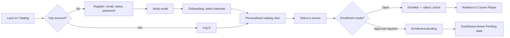
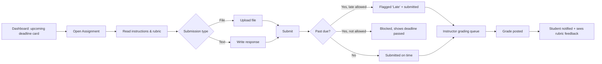
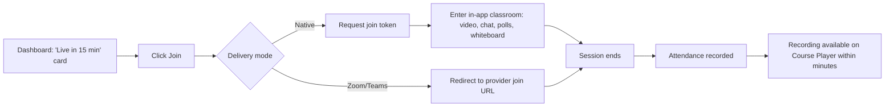
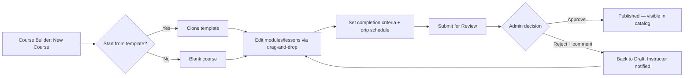

# UI/UX Design Specification Document
## LearnSphere — Learning Management System

| | |
|---|---|
| **Document Version** | 1.0 |
| **Related Documents** | PRD, SRS, System Architecture Document, Database Design Document, API Specification |

---

## 1. Design Principles

1. **Progress is always visible.** Every surface a student sees should answer "where do I stand?" at a glance — course completion, grades, deadlines, streaks. This is the product's core retention lever (PRD §3.2).
2. **One primary action per screen.** Dashboards summarize; they don't compete for attention. Each screen has exactly one obviously-emphasized next action (join session, submit assignment, approve course).
3. **Instructor tools favor bulk and reuse.** Course templates, bulk grading, and bulk enrollment exist because instructor time is the platform's scarcest resource (PRD §4.2).
4. **Live and async feel like one product**, not a video-conferencing tool bolted onto a course library. The classroom UI reuses the same visual language (color, type, components) as the rest of the app.
5. **Accessible by default**, not as a retrofit — every component in the system meets WCAG 2.1 AA from first implementation (NFR-USE-01).

---

## 2. Design System

### 2.1 Signature Element — The Progress Ring
LearnSphere's one recurring, ownable visual motif is a **segmented progress ring**: a circular indicator divided into discrete arcs (one per module, not a smooth percentage sweep). It appears on course cards, the student dashboard header, badge icons, and the instructor's cohort-completion view. Unlike a generic linear progress bar, the segmented ring visually encodes *structure* (how many modules exist) in addition to *completion* (how many are done) — reinforcing that a course is a path with distinct steps, not a single blob of progress. This single element is used deliberately and not over-repeated elsewhere, so it stays meaningful.

### 2.2 Color Palette

| Token | Hex | Usage |
|---|---|---|
| `ink-900` | `#14213D` | Primary text, headers, nav background (dark surfaces) |
| `paper-50` | `#F7F8FA` | App background (light, neutral — not warm cream) |
| `surface-0` | `#FFFFFF` | Card/panel surfaces |
| `accent-progress` (marigold) | `#FFB238` | Progress rings, badges, points, primary achievement accent |
| `accent-live` (teal) | `#17B890` | "Live now" indicators, success states, active session badges |
| `accent-alert` (coral) | `#E85D4E` | Overdue deadlines, destructive actions, validation errors — used sparingly, never as a primary UI color |
| `neutral-600` | `#6B7280` | Secondary text, captions |
| `neutral-200` | `#E5E7EB` | Borders, dividers |
| `focus-ring` | `#3B82F6` | Keyboard focus indicator (distinct from all semantic colors so focus is never ambiguous) |

### 2.3 Typography

| Role | Typeface | Notes |
|---|---|---|
| Display / Headings | **Space Grotesk** (600/700) | Geometric, slightly technical — used for H1–H3, dashboard numbers, course titles |
| Body / UI | **Inter** (400/500) | All body copy, form labels, buttons, nav |
| Data / Utility | **IBM Plex Mono** (400) | Scores, timestamps, verification codes, attendance percentages — anywhere a number needs to feel precise and tabular |

**Type scale (base 16px):** `12 / 14 / 16 / 20 / 24 / 32 / 40` — H1 uses 40/Space Grotesk 700, body uses 16/Inter 400, captions use 12/Inter 500 uppercase with +0.02em tracking.

### 2.4 Spacing & Layout
- 8px base spacing unit; layout grid at 12 columns on desktop (≥1024px), 4 columns on mobile (<640px).
- Cards use 16px internal padding (mobile) / 24px (desktop), 12px corner radius (soft but not pill-shaped — keeps the academic/trustworthy tone rather than a playful consumer-app feel).
- Max content width 1280px, centered, with the dashboard sidebar fixed at 260px on desktop (collapsible to icon rail at 72px on tablet).

### 2.5 Core Components
- **Button** — primary (ink-900 fill), secondary (outline), destructive (accent-alert), all with visible `focus-ring` outline on keyboard focus (2px offset).
- **Progress Ring** — as described in §2.1; small (32px, for list rows), medium (64px, dashboard cards), large (120px, course detail header).
- **Badge Chip** — pill-shaped, accent-progress background, used only for gamification badges (kept visually distinct from status chips).
- **Status Chip** — rectangular, small radius, color-coded by state (`draft`=neutral, `pending_review`=accent-progress, `published`/`active`=accent-live, `rejected`/`overdue`=accent-alert).
- **Data Table** — used in grading queues, admin user lists, audit log; monospace (Plex Mono) for numeric columns, sticky header, row-level bulk-select checkboxes.
- **Toast/Inline Notification** — voice follows the content style guide in §7 (plain, active voice, no apology in errors).

### 2.6 Motion
Motion is used in exactly two deliberate places: (1) the progress ring animates its fill on first load of a dashboard (one-time, ~600ms ease-out) to draw the eye to progress; (2) a live-session "join" button pulses subtly (2s cycle, opacity 0.85→1) only while a session is actually live, so it reads as a genuine status signal rather than decoration. All other UI is static; `prefers-reduced-motion` disables both.

---

## 3. Information Architecture

```mermaid
flowchart TD
    ROOT["LearnSphere"] --> PUBLIC["Public / Unauthenticated"]
    ROOT --> STUDENT["Student Area"]
    ROOT --> INSTRUCTOR["Instructor Area"]
    ROOT --> ADMIN["Admin Area"]
    ROOT --> ALUMNI["Alumni Area"]

    PUBLIC --> P1["Course Catalog"]
    PUBLIC --> P2["Login / Register"]
    PUBLIC --> P3["Certificate Verification"]

    STUDENT --> S1["Dashboard"]
    STUDENT --> S2["My Courses"]
    S2 --> S2a["Course Player (Modules/Lessons)"]
    S2 --> S2b["Assignments & Grades"]
    S2 --> S2c["Live Sessions"]
    S2 --> S2d["Discussion Forum"]
    STUDENT --> S3["Messages"]
    STUDENT --> S4["Badges & Leaderboard"]
    STUDENT --> S5["Certificates"]
    STUDENT --> S6["Notifications"]
    STUDENT --> S7["Profile & Settings"]

    INSTRUCTOR --> I1["Instructor Dashboard"]
    INSTRUCTOR --> I2["Course Builder"]
    I2 --> I2a["Module/Lesson Editor"]
    I2 --> I2b["Templates Library"]
    INSTRUCTOR --> I3["Grading Queue"]
    INSTRUCTOR --> I4["Live Session Scheduler"]
    I4 --> I4a["Live Classroom (Host View)"]
    INSTRUCTOR --> I5["Course Roster & Attendance"]
    INSTRUCTOR --> I6["Reports"]

    ADMIN --> A1["Admin Dashboard"]
    ADMIN --> A2["Course Approval Queue"]
    ADMIN --> A3["User Management"]
    ADMIN --> A4["Audit Log"]
    ADMIN --> A5["Institution Settings"]
    ADMIN --> A6["Events Management"]

    ALUMNI --> AL1["Alumni Dashboard"]
    ALUMNI --> AL2["Certificates & Transcript"]
    ALUMNI --> AL3["Alumni Directory"]
    ALUMNI --> AL4["Events"]
```



---

## 4. Key User Flows

### 4.1 Student Registration & First Enrollment



### 4.2 Assignment Submission



### 4.3 Joining a Live Session



### 4.4 Instructor Course Creation & Publishing



---

## 5. Wireframes — Key Screens

> These are structural/layout wireframes (component placement and hierarchy), not final visual comps. Visual treatment follows the design system in §2.

### 5.1 Student Dashboard (Desktop)

```
┌─────────────────────────────────────────────────────────────────────┐
│  [Logo]      Dashboard   My Courses   Messages   Badges     [🔔][👤] │
├───────────────┬─────────────────────────────────────────────────────┤
│               │  Welcome back, Sara            ◐ 3 of 5 modules done │
│  ○ Dashboard  │  ──────────────────────────────────────────────────  │
│  ○ My Courses │  ⚠ DUE TOMORROW          🔴 LIVE IN 15 MIN           │
│  ○ Messages   │  ┌────────────────────┐  ┌────────────────────┐     │
│  ○ Badges     │  │ Essay: Ch.4 Reflect │  │ Live: Q&A Session  │     │
│  ○ Certif.    │  │ UX Foundations      │  │ [ Join Now ]       │     │
│  ○ Settings   │  └────────────────────┘  └────────────────────┘     │
│               │                                                      │
│               │  My Courses                                         │
│               │  ┌───────────┐ ┌───────────┐ ┌───────────┐          │
│               │  │ (ring 60%)│ │ (ring 90%)│ │ (ring 20%)│          │
│               │  │ UX Found. │ │ Data 101  │ │ Marketing │          │
│               │  └───────────┘ └───────────┘ └───────────┘          │
│               │                                                      │
│               │  Recent Grades          Points & Badges              │
│               │  • Quiz 3 — 88%         🏅 On-Time Streak (5)        │
│               │  • Essay 2 — 92%        420 pts · Rank #4 of 32      │
└───────────────┴─────────────────────────────────────────────────────┘
```
**Behavior notes:** The "LIVE IN 15 MIN" card only renders within the 15-minute pre-window and uses the pulsing join button (§2.6). Deadline cards sort soonest-first; overdue items use `accent-alert` and move to the top regardless of sort.

### 5.2 Course Player (Lesson View)

```
┌─────────────────────────────────────────────────────────────────────┐
│  ← Back to Course        UX Foundations                    ◐ 60%    │
├───────────────┬─────────────────────────────────────────────────────┤
│ MODULE 1 ✓    │                                                      │
│  Lesson 1 ✓   │              [ Video Player 16:9 ]                   │
│  Lesson 2 ✓   │                                                      │
│ MODULE 2 ▶    │  ────────────────────────────────────────────────   │
│  Lesson 3 ●   │  Lesson 3: Heuristic Evaluation           12:04 / 18:30 │
│  Lesson 4 🔒  │                                                      │
│ MODULE 3 🔒   │  Resources: [📄 Slides.pdf]  [📎 Checklist.docx]     │
│  (locked —    │                                                      │
│   releases    │  [ Mark Complete ]        [ Next Lesson → ]         │
│   Jun 10)     │                                                      │
└───────────────┴─────────────────────────────────────────────────────┘
```
**Behavior notes:** 🔒 indicates content locked by a drip-release rule (FR-COURSE-06); hovering/tapping shows the release date. Progress ring in the header updates live as `percentConsumed`/`status` is written via `PUT /courses/{id}/lessons/{id}/progress`.

### 5.3 Instructor — Course Builder (Drag-and-Drop)

```
┌─────────────────────────────────────────────────────────────────────┐
│  UX Foundations — Draft            [ Save Template ] [Submit Review]│
├───────────────────────────────────────────────────────────────────── │
│  + Add Module                                                        │
│  ┌───────────────────────────────────────────────────────────────┐  │
│  │ ⠿ Module 1: Intro to UX                        [Release: Now] │  │
│  │    ⠿ Lesson 1: What is UX?          [video]                   │  │
│  │    ⠿ Lesson 2: The Design Process   [video + article]         │  │
│  │    + Add Lesson                                                │  │
│  └───────────────────────────────────────────────────────────────┘  │
│  ┌───────────────────────────────────────────────────────────────┐  │
│  │ ⠿ Module 2: Evaluation Methods       [Release: +7 days]       │  │
│  │    ⠿ Lesson 3: Heuristic Evaluation [video]                   │  │
│  │    + Add Lesson                                                │  │
│  └───────────────────────────────────────────────────────────────┘  │
│  + Add Module                                                        │
└─────────────────────────────────────────────────────────────────────┘
```
**Behavior notes:** `⠿` denotes a drag handle (keyboard-operable via arrow keys + "grab/drop" announced through ARIA live region — see §6). Reordering persists via `PATCH /courses/{id}` on drop.

### 5.4 Live Classroom (Native, Host View)

```
┌─────────────────────────────────────────────────────────────────────┐
│  ● LIVE — Q&A Session (UX Foundations)           23 participants  ⏱ 18:42 │
├───────────────────────────────────────────┬─────────────────────────┤
│                                             │  Chat                  │
│         [ Instructor Video — Main ]        │  Sara: can you repeat..│
│                                             │  James: 👍             │
│  ┌────┐┌────┐┌────┐┌────┐  +19 more        │  ─────────────────────│
│  │ S1 ││ S2 ││ S3 ││ S4 │                   │  [ Type a message... ]│
│  └────┘└────┘└────┘└────┘                   ├─────────────────────────┤
│                                             │  Poll: "Rate today"   │
│  [🎙][📹][🖐][📊 Poll][🖊 Whiteboard][⏹ End] │  ▓▓▓▓▓▓░░ 72% "Great" │
└─────────────────────────────────────────────┴─────────────────────────┘
```
**Behavior notes:** Ending the session (⏹) triggers a confirmation, then `POST /live-sessions/{id}/end`; attendance and recording processing begin immediately per SAD §5.2.

### 5.5 Admin — Course Approval Queue

```
┌─────────────────────────────────────────────────────────────────────┐
│  Pending Course Approvals (4)                                        │
├─────────────────────────────────────────────────────────────────────┤
│  Course              Instructor      Submitted        Action         │
│  ────────────────────────────────────────────────────────────────── │
│  UX Foundations v2   D. Osei         2 days ago       [Review]       │
│  Intro to SQL        M. Farouk       1 day ago        [Review]       │
│  Marketing Basics    D. Osei         5 hours ago      [Review]       │
└─────────────────────────────────────────────────────────────────────┘
       ↓ (Review opens a detail panel)
┌─────────────────────────────────────────────────────────────────────┐
│  UX Foundations v2 — Full structure preview (read-only)               │
│  [ Modules / Lessons tree, same as Course Builder, non-editable ]     │
│  ┌───────────────────────────┐  ┌───────────────────────────────┐   │
│  │      [ Approve ]           │  │  Rejection comment (required) │   │
│  └───────────────────────────┘  │  [ Reject ]                    │   │
│                                  └───────────────────────────────┘   │
└─────────────────────────────────────────────────────────────────────┘
```

---

## 6. Accessibility Requirements (WCAG 2.1 AA)

| Requirement | Implementation Note |
|---|---|
| Color contrast ≥ 4.5:1 for text | All text/background pairs in §2.2 verified at AA; `accent-progress` on white is used only for large text/icons (fails small-text contrast), never for body copy |
| Full keyboard operability | Drag-and-drop course builder has a keyboard-equivalent (select item → arrow keys to move → Enter to drop), not mouse-only |
| Visible focus indicator | `focus-ring` token (2px, offset), never removed via `outline: none` without replacement |
| Screen-reader labeling | All icon-only buttons (mic/camera/end in live classroom) carry `aria-label`; live regions announce poll results and new chat messages without stealing focus |
| Captions | Native live sessions support live captioning where the browser's Web Speech API is available; recordings are queued for caption generation in the transcoding worker (SAD §4.5) |
| Reduced motion | `prefers-reduced-motion` disables the progress-ring fill animation and join-button pulse |
| Resize/zoom | Layout remains usable up to 200% browser zoom without horizontal scrolling on core flows |

---

## 7. Content & Voice Guidelines

- **Active voice, plain verbs.** "Submit assignment," not "Assignment submission process."
- **Buttons and their resulting confirmations share vocabulary.** A button labeled "Publish" always produces a toast that says "Published," never "Success!" or "Done."
- **Errors state what happened and what to do — no apology, no blame.** E.g., "This file is larger than 2 GB. Compress it or split it into parts." rather than "Oops! Something went wrong."
- **Empty states invite action.** E.g., an instructor's empty Course Builder reads "No modules yet. Add your first module to start building." rather than "No data."
- **Deadlines and status always show absolute + relative time** together where space allows: "Due Jun 12, 11:59 PM (in 2 days)."

---

## 8. Responsive Behavior

| Breakpoint | Layout Change |
|---|---|
| ≥ 1024px (desktop) | Full sidebar (260px) + content; live classroom shows video grid + chat side-by-side |
| 640–1023px (tablet) | Sidebar collapses to a 72px icon rail; live classroom chat becomes a slide-over panel |
| < 640px (mobile) | Sidebar becomes a bottom tab bar (Dashboard, Courses, Messages, Profile); live classroom defaults to speaker view with a swipe-up chat/participants sheet; course player video is full-width with controls beneath |

---
*End of UI/UX Design Specification Document.*
